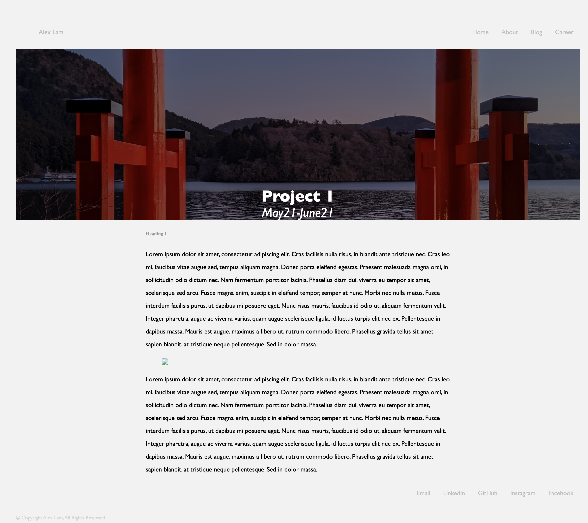

# Alex Lam Coder Academy T1A2 Portfolio 

## URL to published portfolio website 
[https://alam1704.github.io/T1A2/](https://alam1704.github.io/T1A2/)
 

## URL to portfolio GitHub Repository 
[https://github.com/alam1704/T1A2](https://github.com/alam1704/T1A2)
 

## Description of portfolio website 
 

### **Purpose of Website**
This portfolio represents an **online platform** that is readily accessible and will provide an insight into my personality along with my skills, interest and professional knowledge. The **target audience** are prospective employees and the community to showcase my ability as a *coder* and what my capabilities are.
 

### **Sitemap**

 

### **Functionality and Features**
The portfolio consists of 11 HTML pages support by 6 CSS styling sheets. The color theme implemented include black and green fonts on mainly white background as well as background-images. 
 

All pages have a header navbar and footer navbar. The header navbar has my full name on the top left and navigation menu on the top right. This navigation menu consists of the following pages; 'About', 'Blog' and ' Career'. At tablet and desktop viewport sizes, the standard navbar is orientated horizontally. The initial intention was to have a hamburger menu at mobile viewport width. When selected, the hamburger would animate to an "X" and the nav menu would reveal teh navigation column vertically. However, I have yet to solve this problem and hopefully will be able to before submitting my final project.
 

The footer navbar consists of 5 contact links to allow users to contact myself more easily. Similar to the header navbar, the footer navbar is orientated horizonally for tablet and desktop viewports but vertically for mobile viewports. 
 

The navbar links also have hover effects to allow for better accessibility. When a cursor is hovered over, the initial grey text transitions to black with a green border-line beneath the text. A copyright text is also included at the bottom-left of each page, transitioning to the center on smaller device viewports.
 

#### **index.html**
The home page contains project tiles with background images at 100% of width and slight change to linear gradient opacity. The intention is to have the project links change color when hovered. The height is also set at roughly 30% of the viewport height.

 

### **about.html**
The about me page is divided to two uneven columns and implements flex box property to organise each container section (or row). This layout was intended to maximise the amount of white space to achieve a cleaner desktop page. For mobile viewport devices and tablets, the white spaces are utilised and minimised to ensure content covers as much white space in such a small device viewing screen.
 

 ### **career.html**
 Most exciting part of my website in terms of features would have to be the career timeline section. Using CSS, and with the assistance of W3School, I was able to create a timeline to help portray my career and education adventure. I wanted to have a container content box alternate between the left and right of the center timeline with desktop viewport. However, for both tablet and mobile, the containers are all on the right side of the timeline which moves to the left of the page. A resume link is also available right beneath the 'Career' header.
 
  

 ### **blog.html**
 The blog landing page again followed the centric theme of the website. The blog tiles were organised in rows. Each row was organised in a column using flexbox. Each tile had an image with title, a blog heading, with brief description and a call the action button that takes the user into the post. Each blog post was organised similar to the project post - a slightly opaque background image with a blog header and date, followed by the content underneath. Under mobile and tablet viewports, the tile on the main blog page are flexed in a single column. 
  
 
 The project and blog pages essentially have the structure and CSS styling. The projects page can be found at the index page. 

 ### **Tech Stack**
 This portfolio utilises the following languages:
 - HTML
 - CSS
 
 And uses the following Version Control/Deployment platform:
 - GitHub
 - GitHub Pages